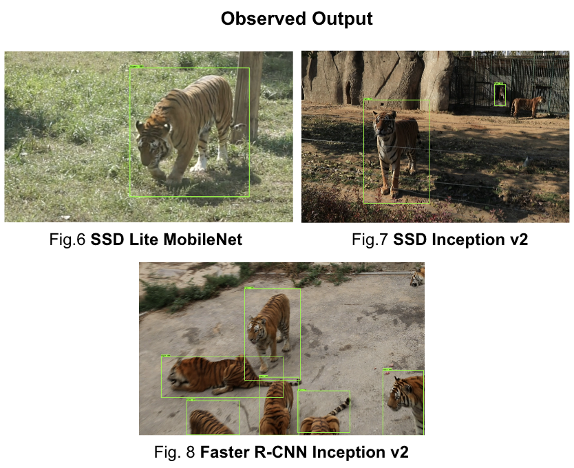

# Using ATRW dataset by CVWC Using TensorFlow (GPU) on Unix Based System for Tiger Detection

## Brief Summary

This repository is a tutorial for how to use TensorFlow's Object Detection API to train an object detection classifier for tigers on Linux. It was originally done to use on NVIDIA DGX remote server having 8 NVIDIA TESLA 16 GB GPUs, available for processing.

This readme describes every step required to train your own custom classifying tiger detectors: 
1. Data Preprocessing
2. Setting up the working environment
3. Creating tfrecords and Configuring training
4. Exporting the inference graph
5. Evaluating the model
6. Deploying it on Raspberry Pi

[Link to our project wrap up video.](https://www.youtube.com/watch?v=6YP9lnc_HiA&feature=youtu.be)

The repository is inspired by the [How To Train an Object Detection Classifier for Multiple Objects Using TensorFlow (GPU) on Windows 10](https://github.com/EdjeElectronics/TensorFlow-Object-Detection-API-Tutorial-Train-Multiple-Objects-Windows-10) repository.

[Appendix: Common Errors](https://github.com/EdjeElectronics/TensorFlow-Object-Detection-API-Tutorial-Train-Multiple-Objects-Windows-10#appendix-common-errors)

<p align="center">
  
</p>

## Introduction
The purpose of this tutorial is to explain how to train your own convolutional neural network object detection classifier for multiple objects, starting from scratch.

TensorFlow-GPU allows you to use the video card to provide extra processing power while training, so it will be used for this tutorial. In my experience, using TensorFlow-GPU instead of regular TensorFlow reduces training time by a factor of about 8 (3 hours to train instead of 24 hours). Regular TensorFlow can also be used for this tutorial, but it will take longer.


## Steps
### 1. Data Preprocessing

#### 1a. Download the ATRW dataset by CVWC
Download the [tiger detection dataset](https://cvwc2019.github.io/challenge.html), both the image dataset and the annotation files.

#### 1b. Edit the discrepancy of filename tags in xml files.
If you open any xml file, you would notice a discrepancy in the name of xml file and in the tag of filename in the xml file, this generates a bug that won't let us generate tfrecords afterwards. We correct this by creating a new tag named Order and re-generating xml files using windows power shell with the correct name with new tag 'Order'. [This powershell custom script was made for this.](https://github.com/growupboron/Tiger-Detection-Using-ATRW-Dataset/blob/master/atrw_xml_correction.ps1) Run the script in your local Windows OS's powershell on the xml files.

#### 1c. Split the dataset into train and test
Copy the train.txt and val.txt files from atrw_anno_detection_train/ImageSets/Main/ directory and the images from the images directory which is Detection_train/ into the atrw_anno_detection_train/Annotations/ directory
In the terminal, issue the following commands to split the dataset into train and validation sets, you should be in the atrw_anno_detection_train/Annotations directory, while issuing these commands.
```
$ mkdir train
$ mkdir val
$ while IFS= read -r filename; do mv "$filename".xml train/; done < train.txt
$ while IFS= read -r filename; do mv "$filename".jpg train/; done < train.txt
$ while IFS= read -r filename; do mv "$filename".xml val/; done < val.txt
$ while IFS= read -r filename; do mv "$filename".jpg val/; done < val.txt
```
### 2. Setting up the working environment
The TensorFlow Object Detection API requires using the specific directory structure provided in its GitHub repository. It also requires several additional Python packages, specific additions to the PATH and PYTHONPATH variables, and a few extra setup commands to get everything set up to run or train an object detection model. 

This portion of the tutorial goes over the full set up required. It is fairly meticulous, but follow the instructions closely, because improper setup can cause unwieldy errors down the road.

#### 2a. Create tmux session and link tensorflow docker image.
As we did it on remote server via SSH, this becomes necessary, alternately you can create virtual environment on your local system.
For creation of new session use the following command.
```
$ tmux new -s session_name
```
Replace the session_name with the name you want to give. When you type this, it will automatically take you to newly created session.
To exit the session just type exit while you are in session. And if you want to just come out of session without exiting the session you can press ctrl+b and then press d.
To re-enter your session, you can type the following command.
```
$ tmux a -t session_name
```
To list all the available sessions, you can use ```$tmux ls``` command.

Now once you are in tmux session, you can start a docker which can be used for training deep learning model. I generally prefer using
NVIDIA-Docker for Deep Learning Models. As we already know that Docker commands are used to pull already created containers. There
are few containers which contain TensorFlow, Caffe, PyTorch and whichever deep learning libraries are available. For this tutorial I will be using TensorFlow Container.

First step is to pull the container from the source. To pull a container
you can use the following command. The command is also used for
accessing the docker container for later usages.

```
$NV_GPU='0,1,2,3,4,5,6,7' nvidia-docker run --name name_of_container --rm -it -v /home/dgxuser104/:/home/dgxuser104/ tensorflow/tensorflow:latest-gpu-py3
```
I generally find it better to link every GPU to the docker container and check the current status of the GPUs in separate SSH terminal displaying the nvidia-smi output and update it every 1 second ```$ watch -n 1 nvidia-smi ``` and then use specific free GPUs to conduct my training. 

#### 2b. Set up TensorFlow Directory.
Create a folder directly and name it “tensorflow1”. This working directory will contain the full TensorFlow object detection framework, as well as your training images, training data, trained classifier, configuration files, and everything else needed for the object detection classifier.

Download the full TensorFlow object detection repository located at https://github.com/tensorflow/models by clicking the “Clone or Download” button and downloading the zip file. Open the downloaded zip file and extract the “models-master” folder directly into the tensorflow1 directory you just created. Rename “models-master” to just “models”.


#### 2b. Download the Faster-RCNN-Inception-V2-COCO model from TensorFlow's model zoo
TensorFlow provides several object detection models (pre-trained classifiers with specific neural network architectures) in its [model zoo](https://github.com/tensorflow/models/blob/master/research/object_detection/g3doc/detection_model_zoo.md). Some models (such as the SSD-MobileNet model) have an architecture that allows for faster detection but with less accuracy, while some models (such as the Faster-RCNN model) give slower detection but with more accuracy.

You can choose which model to train your objection detection classifier on. If you are planning on using the object detector on a device with low computational power (such as a smart phone or Raspberry Pi), use the SDD-MobileNet model. If you will be running your detector on a decently powered laptop or desktop PC, use one of the RCNN models. 

This tutorial will use the Faster-RCNN-Inception-V2 model, we also the same using SSD-Inception-v2 and SSDLite-MobileNet. Download the Faster-RCNN-Inception-V2 model and simultaneously extract by 
```
$ wget http://download.tensorflow.org/models/object_detection/faster_rcnn_inception_v2_coco_2018_01_28.tar.gz
$ tar -xf faster_rcnn_inception_v2_coco_2018_01_28.tar.gz
```
#### 2c. Download this tutorial's repository from GitHub
Download the full repository located on this page (scroll to the top and click Clone or Download) and extract all the contents directly into the tensorflow1/models/research/object_detection directory. (You can overwrite the existing "README.md" file.) This establishes a specific directory structure that will be used for the rest of the tutorial. Also, move the train/ and val/ created earlier from your local system to the server.

At this point, here is what your /object_detection folder should look like, the following are the important bits:

```
tensorflow1
|
|-- models
|   |-- research
|		|-- object_detection
|			|-- images
|			|	|-- train
|			|	|-- val
|			|-- faster_rcnn_inception_v2_coco_2018_01_28
|						
```

#### 2d. Configure PYTHONPATH environment variable and install the dependencies

```
$ export PYTHONPATH=/home/dgxuser104/Balmukund/tensorflow1/models:/home/dgxuser104/Balmukund/tensorflow1/models/research:/home/dgxuser104/Balmukund/tensorflow1/models/research/slim:/home/dgxuser104/Balmukund/tensorflow1/models/research/object_detection
$ export PATH=$PATH:$PYTHONPATH
$ pip install tensorflow-gpu==1.8
$ pip install pillow lxml Cython matplotlib pandas opencv-python
```
(Note: The ‘pandas’ and ‘opencv-python’ packages are not needed by TensorFlow, but they are used in the Python scripts to generate TFRecords and to work with images, videos, and webcam feeds.)

#### 2e. Compile Protobufs and run setup.py
Next, compile the Protobuf files, which are used by TensorFlow to configure model and training parameters. Unfortunately, the short protoc compilation command posted on TensorFlow’s Object Detection API [installation page](https://github.com/tensorflow/models/blob/master/research/object_detection/g3doc/installation.md) does not work everytime. Every  .proto file in the /object_detection/protos directory must be called out individually by the command.

In the tmux session terminal, change directories to the tensorflow1//models/research directory and copy and paste the following command into the command line and press Enter:
```
protoc --python_out=object_detection object_detection/protos/anchor_generator.proto object_detection/protos/argmax_matcher.proto object_detection/protos object_detection/protos/anchor_generator.proto object_detection/protos/input_reader.proto object_detection/protos/losses.proto object_detection/protos/matcher.proto object_detection/protos/argmax_matcher.proto object_detection/protos/bipartite_matcher.proto object_detection/protos/box_coder.proto object_detection/protos/box_predictor.proto object_detection/protos/eval.proto object_detection/protos/faster_rcnn.proto object_detection/protos/faster_rcnn_box_coder.proto object_detection/protos/grid_anchor_generator.proto object_detection/protos/hyperparams.proto object_detection/protos/image_resizer.proto object_detection/protos/input_reader.proto object_detection/protos/losses.proto object_detection/protos/matcher.proto object_detection/protos/mean_stddev_box_coder.proto object_detection/protos/model.proto object_detection/protos/optimizer.proto object_detection/protos/pipeline.proto object_detection/protos/post_processing.proto object_detection/protos/preprocessor.proto object_detection/protos/region_similarity_calculator.proto object_detection/protos/square_box_coder.proto object_detection/protos/ssd.proto object_detection/protos/ssd_anchor_generator.proto object_detection/protos/string_int_label_map.proto object_detection/protos/train.proto object_detection/protos/keypoint_box_coder.proto object_detection/protos/multiscale_anchor_generator.proto object_detection/protos/graph_rewriter.proto object_detection/protos/calibration.proto object_detection/protos/flexible_grid_anchor_generator.proto
```
This creates a name_pb2.py file from every name.proto file in the /object_detection/protos folder.

**(Note: TensorFlow occassionally adds new .proto files to the /protos folder. If you get an error saying ImportError: cannot import name 'something_something_pb2' , you may need to update the protoc command to include the new .proto files.)**

Finally, run the following commands from the /tensorflow1/models/research directory:
```
$ python setup.py build
$ python setup.py install
```

### 3. Gather and Label Pictures
Now that the TensorFlow Object Detection API is all set up and ready to go, we need to provide the images it will use to train a new detection classifier.

#### 3a. Gather Pictures
TensorFlow needs hundreds of images of an object to train a good detection classifier. To train a robust classifier, the training images should have random objects in the image along with the desired objects, and should have a variety of backgrounds and lighting conditions. There should be some images where the desired object is partially obscured, overlapped with something else, or only halfway in the picture. 

For my Pinochle Card Detection classifier, I have six different objects I want to detect (the card ranks nine, ten, jack, queen, king, and ace – I am not trying to detect suit, just rank). I used my iPhone to take about 40 pictures of each card on its own, with various other non-desired objects in the pictures. Then, I took about another 100 pictures with multiple cards in the picture. I know I want to be able to detect the cards when they’re overlapping, so I made sure to have the cards be overlapped in many images.

<p align="center">
  
</p>

You can use your phone to take pictures of the objects or download images of the objects from Google Image Search. I recommend having at least 200 pictures overall. I used 311 pictures to train my card detector.

Make sure the images aren’t too large. They should be less than 200KB each, and their resolution shouldn’t be more than 720x1280. The larger the images are, the longer it will take to train the classifier. You can use the resizer.py script in this repository to reduce the size of the images.

After you have all the pictures you need, move 20% of them to the \object_detection\images\test directory, and 80% of them to the \object_detection\images\train directory. Make sure there are a variety of pictures in both the \test and \train directories.

#### 3b. Label Pictures
Here comes the fun part! With all the pictures gathered, it’s time to label the desired objects in every picture. LabelImg is a great tool for labeling images, and its GitHub page has very clear instructions on how to install and use it.

[LabelImg GitHub link](https://github.com/tzutalin/labelImg)

[LabelImg download link](https://www.dropbox.com/s/tq7zfrcwl44vxan/windows_v1.6.0.zip?dl=1)

Download and install LabelImg, point it to your \images\train directory, and then draw a box around each object in each image. Repeat the process for all the images in the \images\test directory. This will take a while! 

<p align="center">
  
</p>

LabelImg saves a .xml file containing the label data for each image. These .xml files will be used to generate TFRecords, which are one of the inputs to the TensorFlow trainer. Once you have labeled and saved each image, there will be one .xml file for each image in the \test and \train directories.

Also, you can check if the size of each bounding box is correct by running sizeChecker.py

```
(tensorflow1) C:\tensorflow1\models\research\object_detection> python sizeChecker.py --move
```

### 4. Generate Training Data
With the images labeled, it’s time to generate the TFRecords that serve as input data to the TensorFlow training model. This tutorial uses the xml_to_csv.py and generate_tfrecord.py scripts from [Dat Tran’s Raccoon Detector dataset](https://github.com/datitran/raccoon_dataset), with some slight modifications to work with our directory structure.

First, the image .xml data will be used to create .csv files containing all the data for the train and test images. From the \object_detection folder, issue the following command in the Anaconda command prompt:
```
(tensorflow1) C:\tensorflow1\models\research\object_detection> python xml_to_csv.py
```
This creates a train_labels.csv and test_labels.csv file in the \object_detection\images folder. 

Next, open the generate_tfrecord.py file in a text editor. Replace the label map starting at line 31 with your own label map, where each object is assigned an ID number. This same number assignment will be used when configuring the labelmap.pbtxt file in Step 5b. 

For example, say you are training a classifier to detect basketballs, shirts, and shoes. You will replace the following code in generate_tfrecord.py:
```
# TO-DO replace this with label map
def class_text_to_int(row_label):
    if row_label == 'nine':
        return 1
    elif row_label == 'ten':
        return 2
    elif row_label == 'jack':
        return 3
    elif row_label == 'queen':
        return 4
    elif row_label == 'king':
        return 5
    elif row_label == 'ace':
        return 6
    else:
        return None
```
With this:
```
# TO-DO replace this with label map
def class_text_to_int(row_label):
    if row_label == 'basketball':
        return 1
    elif row_label == 'shirt':
        return 2
    elif row_label == 'shoe':
        return 3
    else:
        return None
```
Then, generate the TFRecord files by issuing these commands from the \object_detection folder:
```
python generate_tfrecord.py --csv_input=images\train_labels.csv --image_dir=images\train --output_path=train.record
python generate_tfrecord.py --csv_input=images\test_labels.csv --image_dir=images\test --output_path=test.record
```
These generate a train.record and a test.record file in \object_detection. These will be used to train the new object detection classifier.

### 5. Create Label Map and Configure Training
The last thing to do before training is to create a label map and edit the training configuration file.

#### 5a. Label map
The label map tells the trainer what each object is by defining a mapping of class names to class ID numbers. Use a text editor to create a new file and save it as labelmap.pbtxt in the C:\tensorflow1\models\research\object_detection\training folder. (Make sure the file type is .pbtxt, not .txt !) In the text editor, copy or type in the label map in the format below (the example below is the label map for my Pinochle Deck Card Detector):
```
item {
  id: 1
  name: 'nine'
}

item {
  id: 2
  name: 'ten'
}

item {
  id: 3
  name: 'jack'
}

item {
  id: 4
  name: 'queen'
}

item {
  id: 5
  name: 'king'
}

item {
  id: 6
  name: 'ace'
}
```
The label map ID numbers should be the same as what is defined in the generate_tfrecord.py file. For the basketball, shirt, and shoe detector example mentioned in Step 4, the labelmap.pbtxt file will look like:
```
item {
  id: 1
  name: 'basketball'
}

item {
  id: 2
  name: 'shirt'
}

item {
  id: 3
  name: 'shoe'
}
```

#### 5b. Configure training
Finally, the object detection training pipeline must be configured. It defines which model and what parameters will be used for training. This is the last step before running training!

Navigate to C:\tensorflow1\models\research\object_detection\samples\configs and copy the faster_rcnn_inception_v2_pets.config file into the \object_detection\training directory. Then, open the file with a text editor. There are several changes to make to the .config file, mainly changing the number of classes and examples, and adding the file paths to the training data.

Make the following changes to the faster_rcnn_inception_v2_pets.config file. Note: The paths must be entered with single forward slashes (NOT backslashes), or TensorFlow will give a file path error when trying to train the model! Also, the paths must be in double quotation marks ( " ), not single quotation marks ( ' ).

- Line 9. Change num_classes to the number of different objects you want the classifier to detect. For the above basketball, shirt, and shoe detector, it would be num_classes : 3 .
- Line 110. Change fine_tune_checkpoint to:
  - fine_tune_checkpoint : "C:/tensorflow1/models/research/object_detection/faster_rcnn_inception_v2_coco_2018_01_28/model.ckpt"

- Lines 126 and 128. In the train_input_reader section, change input_path and label_map_path to:
  - input_path : "C:/tensorflow1/models/research/object_detection/train.record"
  - label_map_path: "C:/tensorflow1/models/research/object_detection/training/labelmap.pbtxt"

- Line 132. Change num_examples to the number of images you have in the \images\test directory.

- Lines 140 and 142. In the eval_input_reader section, change input_path and label_map_path to:
  - input_path : "C:/tensorflow1/models/research/object_detection/test.record"
  - label_map_path: "C:/tensorflow1/models/research/object_detection/training/labelmap.pbtxt"

Save the file after the changes have been made. That’s it! The training job is all configured and ready to go!

### 6. Run the Training
**UPDATE 9/26/18:** 
*As of version 1.9, TensorFlow has deprecated the "train.py" file and replaced it with "model_main.py" file. I haven't been able to get model_main.py to work correctly yet (I run in to errors related to pycocotools). Fortunately, the train.py file is still available in the /object_detection/legacy folder. Simply move train.py from /object_detection/legacy into the /object_detection folder and then continue following the steps below.*

Here we go! From the \object_detection directory, issue the following command to begin training:
```
python train.py --logtostderr --train_dir=training/ --pipeline_config_path=training/faster_rcnn_inception_v2_pets.config
```
If everything has been set up correctly, TensorFlow will initialize the training. The initialization can take up to 30 seconds before the actual training begins. When training begins, it will look like this:

<p align="center">
  
</p>

Each step of training reports the loss. It will start high and get lower and lower as training progresses. For my training on the Faster-RCNN-Inception-V2 model, it started at about 3.0 and quickly dropped below 0.8. I recommend allowing your model to train until the loss consistently drops below 0.05, which will take about 40,000 steps, or about 2 hours (depending on how powerful your CPU and GPU are). Note: The loss numbers will be different if a different model is used. MobileNet-SSD starts with a loss of about 20, and should be trained until the loss is consistently under 2.

You can view the progress of the training job by using TensorBoard. To do this, open a new instance of Anaconda Prompt, activate the tensorflow1 virtual environment, change to the C:\tensorflow1\models\research\object_detection directory, and issue the following command:
```
(tensorflow1) C:\tensorflow1\models\research\object_detection>tensorboard --logdir=training
```
This will create a webpage on your local machine at YourPCName:6006, which can be viewed through a web browser. The TensorBoard page provides information and graphs that show how the training is progressing. One important graph is the Loss graph, which shows the overall loss of the classifier over time.

<p align="center">
  
</p>

The training routine periodically saves checkpoints about every five minutes. You can terminate the training by pressing Ctrl+C while in the command prompt window. I typically wait until just after a checkpoint has been saved to terminate the training. You can terminate training and start it later, and it will restart from the last saved checkpoint. The checkpoint at the highest number of steps will be used to generate the frozen inference graph.

### 7. Export Inference Graph
Now that training is complete, the last step is to generate the frozen inference graph (.pb file). From the \object_detection folder, issue the following command, where “XXXX” in “model.ckpt-XXXX” should be replaced with the highest-numbered .ckpt file in the training folder:
```
python export_inference_graph.py --input_type image_tensor --pipeline_config_path training/faster_rcnn_inception_v2_pets.config --trained_checkpoint_prefix training/model.ckpt-XXXX --output_directory inference_graph
```
This creates a frozen_inference_graph.pb file in the \object_detection\inference_graph folder. The .pb file contains the object detection classifier.

### 8. Use Your Newly Trained Object Detection Classifier!
The object detection classifier is all ready to go! I’ve written Python scripts to test it out on an image, video, or webcam feed.

Before running the Python scripts, you need to modify the NUM_CLASSES variable in the script to equal the number of classes you want to detect. (For my Pinochle Card Detector, there are six cards I want to detect, so NUM_CLASSES = 6.)

To test your object detector, move a picture of the object or objects into the \object_detection folder, and change the IMAGE_NAME variable in the Object_detection_image.py to match the file name of the picture. Alternatively, you can use a video of the objects (using Object_detection_video.py), or just plug in a USB webcam and point it at the objects (using Object_detection_webcam.py).

To run any of the scripts, type “idle” in the Anaconda Command Prompt (with the “tensorflow1” virtual environment activated) and press ENTER. This will open IDLE, and from there, you can open any of the scripts and run them.

If everything is working properly, the object detector will initialize for about 10 seconds and then display a window showing any objects it’s detected in the image!

<p align="center">
  
</p>

If you encounter errors, please check out the Appendix: it has a list of errors that I ran in to while setting up my object detection classifier. You can also trying Googling the error. There is usually useful information on Stack Exchange or in TensorFlow’s Issues on GitHub.

## Appendix: Common Errors
It appears that the TensorFlow Object Detection API was developed on a Linux-based operating system, and most of the directions given by the documentation are for a Linux OS. Trying to get a Linux-developed software library to work on Windows can be challenging. There are many little snags that I ran in to while trying to set up tensorflow-gpu to train an object detection classifier on Windows 10. This Appendix is a list of errors I ran in to, and their resolutions.

#### 1. ModuleNotFoundError: No module named 'deployment'

This error occurs when you try to run object_detection_tutorial.ipynb or train.py and you don’t have the PATH and PYTHONPATH environment variables set up correctly. Exit the virtual environment by closing and re-opening the Anaconda Prompt window. Then, issue “activate tensorflow1” to re-enter the environment, and then issue the commands given in Step 2e. 

You can use “echo %PATH%” and “echo %PYTHONPATH%” to check the environment variables and make sure they are set up correctly.

Also, make sure you have run these commands from the \models\research directory:
```
setup.py build
setup.py install
```

#### 2. ImportError: cannot import name 'preprocessor_pb2'

#### ImportError: cannot import name 'string_int_label_map_pb2'

#### (or similar errors with other pb2 files)

This occurs when the protobuf files (in this case, preprocessor.proto) have not been compiled. Re-run the protoc command given in Step 2f. Check the \object_detection\protos folder to make sure there is a name_pb2.py file for every name.proto file.

#### 3. object_detection/protos/.proto: No such file or directory

This occurs when you try to run the
```
“protoc object_detection/protos/*.proto --python_out=.”
```
command given on the TensorFlow Object Detection API installation page. Sorry, it doesn’t work on Windows! Copy and paste the full command given in Step 2f instead. There’s probably a more graceful way to do it, but I don’t know what it is.

#### 4. Unsuccessful TensorSliceReader constructor: Failed to get "file path" … The filename, directory name, or volume label syntax is incorrect.
  
This error occurs when the filepaths in the training configuration file (faster_rcnn_inception_v2_pets.config or similar) have not been entered with backslashes instead of forward slashes. Open the .config file and make sure all file paths are given in the following format:
```
“C:/path/to/model.file”
```

#### 5. ValueError: Tried to convert 't' to a tensor and failed. Error: Argument must be a dense tensor: range(0, 3) - got shape [3], but wanted [].

The issue is with models/research/object_detection/utils/learning_schedules.py Currently it is
```
rate_index = tf.reduce_max(tf.where(tf.greater_equal(global_step, boundaries),
                                      range(num_boundaries),
                                      [0] * num_boundaries))
```
Wrap list() around the range() like this:

```
rate_index = tf.reduce_max(tf.where(tf.greater_equal(global_step, boundaries),
                                     list(range(num_boundaries)),
                                      [0] * num_boundaries))
```

[Ref: Tensorflow Issue#3705](https://github.com/tensorflow/models/issues/3705#issuecomment-375563179)